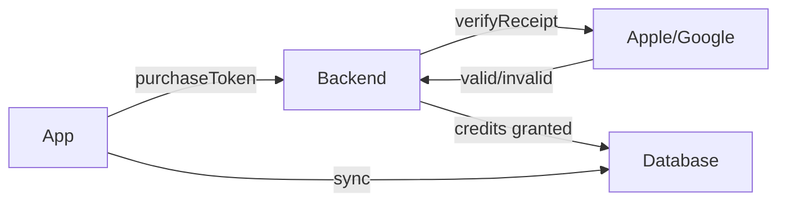

# Mystic Fate — 外部对接方案

---

## 一、支付集成（Apple Pay / Google Play）

### 当前状态
- ✅ 前端 UI 就绪（3 个积分套餐 + Pro 订阅）
- ✅ `PaymentManager` 类完整（`addCredits`, `spendCredits`, `saveState`）
- ❌ 未对接 IAP SDK（StoreKit / Google Play Billing）
- ❌ 未实现收据验证（Receipt Validation）

### 所需前提
| 项 | 说明 |
|---|------|
| Apple Developer 账号 | 年费 $99，用于 iOS 发布 |
| Google Play Console 账号 | 一次性 $25，用于 Android 发布 |
| App Store Connect 配置 | 创建 IAP 商品（Consumable: 积分 / Subscription: Pro） |
| Google Play 商品配置 | 创建 Managed Products（积分）+ Subscriptions（Pro） |

### 实现步骤

#### Step 1：在 App Store Connect / Google Play Console 创建商品

```
IAP 商品 ID 清单（已在 config.ts 中预定义）：

积分包：
  mystic_fate.credits_30    → $1.99  (30 credits)
  mystic_fate.credits_100   → $4.99  (100 credits)
  mystic_fate.credits_250   → $9.99  (250 credits)

订阅：
  mystic_fate.pro_monthly   → $14.99/月 (Pro 订阅)
  mystic_fate.pro_yearly    → $99.99/年 (Pro 订阅)
```

#### Step 2：安装 IAP SDK

**RN 项目（mystic-fate/）：**
```bash
cd mystic-fate && npx expo install expo-in-app-purchases
```

**SPA 项目（app/）：** Web 版使用 Stripe
```bash
cd app && npm install @stripe/stripe-js
```

#### Step 3：实现购买流程

1. `PaymentManager.buyProduct(productId)` → 调用 IAP SDK
2. SDK 弹出系统支付对话框 → 用户 Touch ID / Face ID 验证
3. 购买成功后，SDK 返回 `purchaseToken` / `transactionReceipt`
4. **前端将收据发送到后端** → 后端验证收据真实性 →
5. 验证通过后，给用户账号增加积分 / 激活 Pro
6. `payment-module.js` 的 `saveState()` 已包含 `cloud-sync.js` 推送

#### Step 4：收据验证（Security）



- 后端 Edge Function 验证收据
- 防止篡改：服务端校验签名
- 防止重放：记录 `transactionId` 去重

#### Step 5：测试

| 环境 | 方式 |
|------|------|
| iOS Sandbox | 使用 Sandbox Tester 账号 |
| Android Test | 使用 Internal Test Track |
| Stripe Test | 使用 `4242 4242 4242 4242` 测试卡 |

### 涉及文件
- `mystic-fate/src/services/payment.ts`（新建）
- `mystic-fate/src/constants/config.ts`（已有，更新 IAP 配置）
- `app/payment-module.js`（已有，扩充购买逻辑）
- `app/app-config.js`（已有，添加 Stripe Key）

### 预估工时
| 阶段 | 工时 |
|------|------|
| 商品创建（App Store + Google Play） | 2h |
| SDK 集成 + 购买流程 | 4h |
| 收据验证后端 | 3h |
| 测试 + 修复 | 3h |
| **合计** | **12h** |

---

## 二、推送通知（每日天机提醒）

### 当前状态
- ❌ 无推送基础设施
- ❌ 无通知权限请求
- ❌ 无定时推送逻辑

### 实现架构

```
用户设置推送时间 → 前端注册设备 Token → 后端存储 Token
                                     ↓
                        后端定时任务（每日 7:00/12:00/18:00）
                                     ↓
                        调用 AI 生成"每日天机"
                                     ↓
                        通过 FCM/APNs 推送到用户设备
```

### Step 1：选择推送服务

推荐 **Firebase Cloud Messaging (FCM)**（同时支持 Android + iOS）：

| 前提 | 说明 |
|------|------|
| Firebase 项目 | 在 console.firebase.google.com 创建 |
| Google Services JSON | Android: `google-services.json` |
| APNs Key | iOS: 在 Apple Developer 生成 APNs Auth Key |
| Expo Push Token | 通过 `expo-notifications` 获取 |

### Step 2：安装依赖

```bash
cd mystic-fate && npx expo install expo-notifications expo-device
```

### Step 3：前端实现

```typescript
// 1. 请求通知权限
import * as Notifications from 'expo-notifications';
const { status } = await Notifications.requestPermissionsAsync();

// 2. 获取 Expo Push Token
import { getExpoPushTokenAsync } from 'expo-notifications';
const token = (await getExpoPushTokenAsync()).data;

// 3. 发送到后端存储
await supabase.from('push_tokens').upsert({
  user_id: userId,
  token: token,
  platform: Platform.OS,
});

// 4. 设置通知处理
Notifications.setNotificationHandler({
  handleNotification: async () => ({
    shouldShowAlert: true,
    shouldPlaySound: true,
  }),
});
```

### Step 4：后端定时推送（Supabase Edge Function）

```typescript
// supabase/functions/daily-whisper/index.ts
import { serve } from 'https://deno.land/std@0.168.0/http/server.ts'

serve(async (req) => {
  // 1. 查询所有已注册推送 Token
  const { data: tokens } = await supabase
    .from('push_tokens')
    .select('token, user_id');
  
  // 2. 批量调用 DeepSeek 生成每日天机
  for (const { token, user_id } of tokens) {
    const whisper = await generateDailyWhisper(user_id);
    
    // 3. 通过 Expo Push API 发送
    await fetch('https://exp.host/--/api/v2/push/send', {
      method: 'POST',
      headers: { 'Content-Type': 'application/json' },
      body: JSON.stringify({
        to: token,
        title: '✨ 每日天机',
        body: whisper.summary,
        data: { screen: 'oracle' },
      }),
    });
  }
});
```

### Step 5：用户设置界面

在 Profile Tab 中添加：
- 推送开关（开启/关闭每日天机）
- 推送时间选择（早 7:00 / 中午 12:00 / 晚 18:00）
- 签到提醒开关

### 涉及文件
- `mystic-fate/src/services/notification.ts`（新建）
- `mystic-fate/app/(tabs)/profile.tsx`（已有，扩充设置）
- `mystic-fate/app/_layout.tsx`（已有，添加通知初始化）
- `supabase/functions/daily-whisper/index.ts`（新建 Edge Function）

### 新增数据库表
```sql
CREATE TABLE push_tokens (
  id UUID PRIMARY KEY DEFAULT gen_random_uuid(),
  user_id UUID REFERENCES user_profiles(id),
  token TEXT NOT NULL UNIQUE,
  platform TEXT,
  push_enabled BOOLEAN DEFAULT true,
  push_time TIME DEFAULT '07:00',
  created_at TIMESTAMPTZ DEFAULT NOW()
);
```

### 预估工时
| 阶段 | 工时 |
|------|------|
| Firebase 项目 + 证书配置 | 2h |
| 前端通知集成 | 3h |
| Edge Function 定时推送 | 3h |
| 用户设置界面 | 2h |
| **合计** | **10h** |

---

## 三、i18n 国际化

### 当前状态
- ❌ 所有文案硬编码为中文
- ❌ 无 i18n 框架
- ✅ 字体系统已包含中英文（Noto Serif SC + Inter）

### 实现方案

#### 方案选择：`react-i18next`（React Native） + 自定义 i18n（SPA）

#### Step 1：RN 项目安装

```bash
cd mystic-fate && npm install i18next react-i18next
```

#### Step 2：翻译文件结构

```typescript
// src/i18n/zh.ts
export default {
  common: {
    appName: 'Mystic Fate',
    loading: '加载中...',
    confirm: '确认',
    cancel: '取消',
    save: '保存',
  },
  home: {
    title: '命盘',
    birthInput: '输入出生信息',
    startReading: '开始解读',
  },
  oracle: {
    dailyWhisper: '每日天机',
    deepReading: '深度解读',
    monthlyGuide: '月运趋势',
  },
  chart: {
    mingGong: '命宫',
    xiongDi: '兄弟宫',
    fuQi: '夫妻宫',
    // ... 12 宫
  },
  star: {
    ziWei: '紫微',
    tianJi: '天机',
    taiYang: '太阳',
    // ... 14 主星
  },
  payment: {
    credits: '积分',
    buyCredits: '购买积分',
    proSubscription: 'Pro 订阅',
  },
  // ~200 个 key，覆盖全部 UI
};

// src/i18n/en.ts
export default {
  common: {
    appName: 'Mystic Fate',
    loading: 'Loading...',
    confirm: 'Confirm',
    cancel: 'Cancel',
    save: 'Save',
  },
  // ... 相同结构，英文版
};
```

#### Step 3：初始化 i18n

```typescript
// src/i18n/index.ts
import i18n from 'i18next';
import { initReactI18next } from 'react-i18next';
import AsyncStorage from '@react-native-async-storage/async-storage';
import zh from './zh';
import en from './en';

i18n.use(initReactI18next).init({
  resources: { zh: { translation: zh }, en: { translation: en } },
  lng: 'zh', // 默认中文
  fallbackLng: 'en',
  interpolation: { escapeValue: false },
});
```

#### Step 4：接入组件

```tsx
// 使用方式
import { useTranslation } from 'react-i18next';

function HomeScreen() {
  const { t } = useTranslation();
  return <Text>{t('home.title')}</Text>;
}
```

#### Step 5：SPA 版 i18n

`app/` 使用轻量级手写方案，无需额外依赖：

```javascript
// i18n.js
window.I18n = {
  locale: 'zh',
  strings: {
    zh: { /* 同 RN 翻译结构 */ },
    en: { /* 英文翻译 */ },
  },
  t(key) {
    return key.split('.').reduce((o, k) => o?.[k], this.strings[this.locale]) || key;
  },
  setLocale(locale) {
    this.locale = locale;
    document.documentElement.lang = locale;
    document.querySelectorAll('[data-i18n]').forEach(el => {
      el.textContent = this.t(el.dataset.i18n);
    });
  },
};
```

#### Step 6：语言切换设置

在 Profile Tab 中添加语言选择：
- 简体中文 🇨🇳
- English 🇺🇸
- 跟随系统（通过 `expo-localization` 检测）

```bash
cd mystic-fate && npx expo install expo-localization
```

```typescript
import * as Localization from 'expo-localization';
const deviceLang = Localization.getLocales()[0].languageCode;
i18n.changeLanguage(deviceLang === 'zh' ? 'zh' : 'en');
```

### 涉及文件
- `mystic-fate/src/i18n/`（新建目录，~6 文件）
- `app/i18n.js`（新建）
- `app/index.html`（已有，添加 `data-i18n` 属性）
- `mystic-fate/app/(tabs)/profile.tsx`（已有，添加语言切换）

### 翻译量估算
| 语言 | 词条数 | 说明 |
|------|--------|------|
| 中文 | 200+ | 本文已在用 |
| 英文 | 200+ | 需翻译（紫微斗数术语需专家审核） |

### 预估工时
| 阶段 | 工时 |
|------|------|
| i18n 框架搭建（RN + SPA） | 3h |
| 中文词条提取（从所有页面） | 2h |
| 英文翻译 | 4h（含紫微术语核对） |
| 页面改造（RN） | 3h |
| 页面改造（SPA） | 2h |
| **合计** | **14h** |

---

## 四、优先级建议

| 优先级 | 项目 | 原因 |
|--------|------|------|
| 🥇 | **i18n 国际化** | 不需要外部账号，翻译即可；提升多语言用户体验 |
| 🥇 | **支付集成** | 收入来源，App 上线必要条件 |
| 🥈 | **推送通知** | 提升留存率，但可在上线后迭代 |

> **建议顺序**：先做 i18n（零门槛） → 同时申请开发者账号（审核需 1-2 周） → 账号到手后做支付 → 最后推送